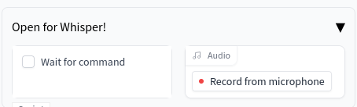

# ASR in webui
This extension adds Automatic Speech Recognition (ASR) functionality to the [Stable Diffusion Webui](https://github.com/AUTOMATIC1111/stable-diffusion-webui) project, using OpenAI's [Whisper](https://github.com/openai/whisper).



You may need to run,
```sh
sudo apt install libportaudio2
```
prior to installation.

## Todo
* Filling in other prompt properties (like -ve prompts, sampler, etc)
* Avoid locking Gradio in busy loop
* Fix audio source

## Bugs
Too many to count
